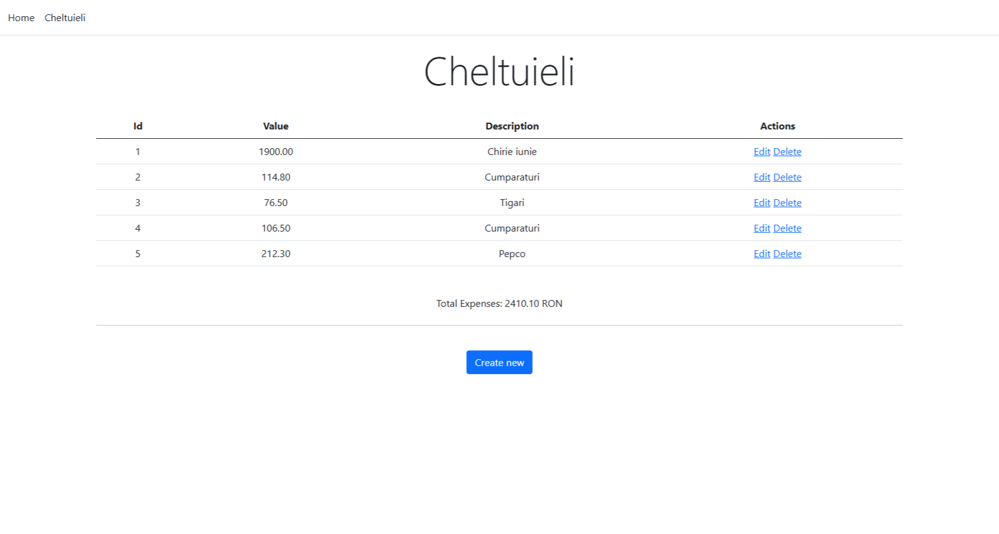
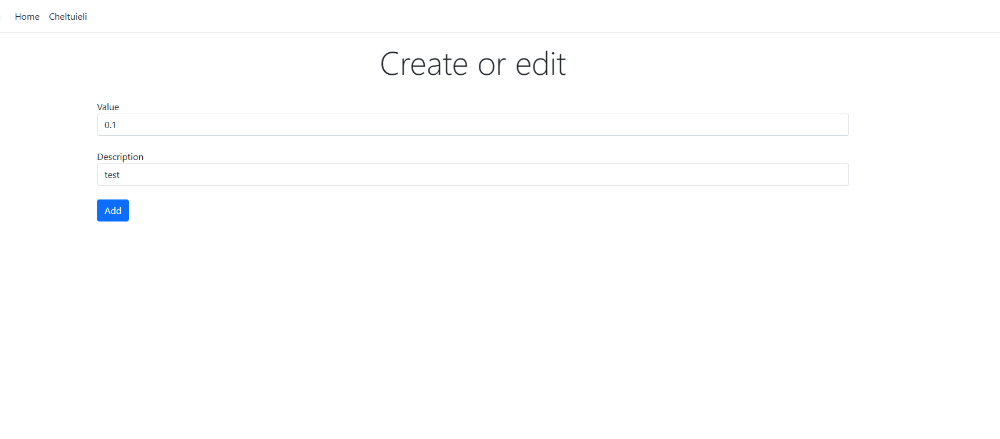

 # 🏠 Household Expense Tracker (Private)

A full-stack web app to track and manage household expenses. Built using ASP.NET Core MVC, Entity Framework, and hosted on Azure App Service with Azure SQL Database for persistent storage.

---

## 🚀 Features

- Add, view, update, and delete expense entries
- Organize expenses by category and date
- View expenses in a sortable table
- Secure Azure SQL integration using Entity Framework Core
- Deployed on Azure App Service with environment-specific configuration

---

## 🛠️ Tech Stack

| Layer           | Tech                                 |
|-----------------|--------------------------------------|
| Frontend        | Razor Views (ASP.NET Core MVC)       |
| Backend         | C# (.NET 8), Entity Framework Core   |
| Database        | Azure SQL Database                   |
| Hosting         | Azure App Service                    |
| Auth (optional) | Azure App Identity or SQL Login      |

---

## 🔒 Private Deployment

> This app is deployed to a private Azure App Service instance and is not publicly accessible.

If you'd like to see the app functionality, please refer to the screenshots below.

---

## 📸 Screenshots


*View of all household expenses with edit/delete actions*


*Form to add a new / edit an existing expense entry*

---

## ⚙️ Setup & Configuration (Local Use)

1. Clone this repository:
   ```bash
   git clone https://github.com/yourusername/household-expense-tracker.git
   cd household-expense-tracker
2. Configure the connection string in appsettings.Development.json:
   ```bash
   "ConnectionStrings": {
   "AZURE_SQL_CONNECTIONSTRING": "Server=...;Database=...;User Id=...;Password=...;"
   }

3. Run the application locally:
   ```bash
   dotnet build
   dotnet ef database update
   dotnet run
---
## 🙋‍♂️ Author

**Rusu Mario Antonio**  
Student @ UTCN • Aspiring .NET Developer  
